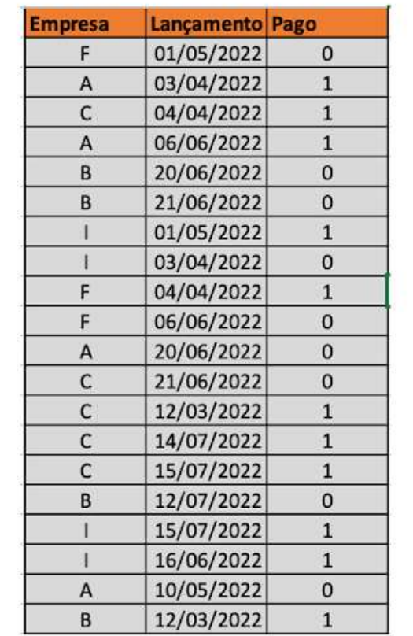

# Desafio

## 

Ranking de pagadores: a Consultoria PLANNING foi contratada pela empresa PAGUE para construir um modelo que calculasse o ranking de bons pagadores on-line.
Para isso disponibilizou a tabela de status dos pagamentos previstos por empresa(1- pagou 0 - Não pagou)

Dado o enunciado em questão, crie um bloco de código em Java que calcule a média de pagamentos por empresa e publique o ranking das empresas.

